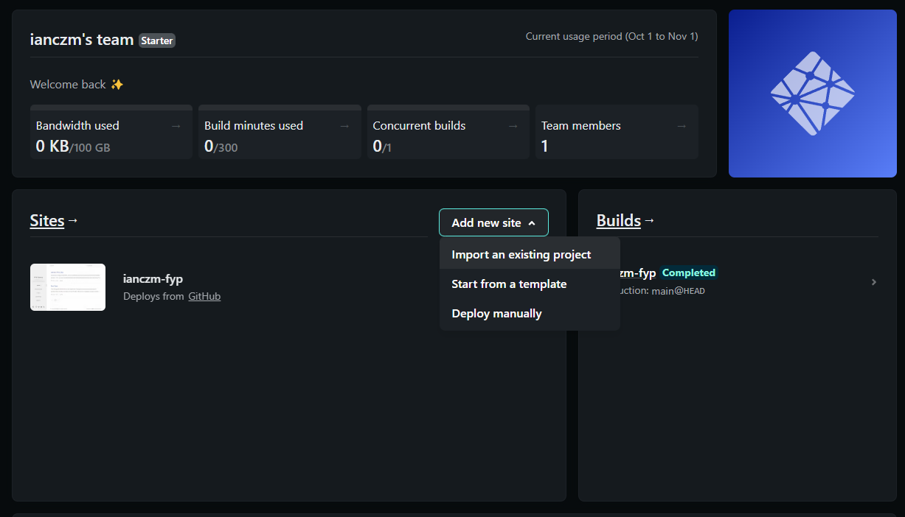
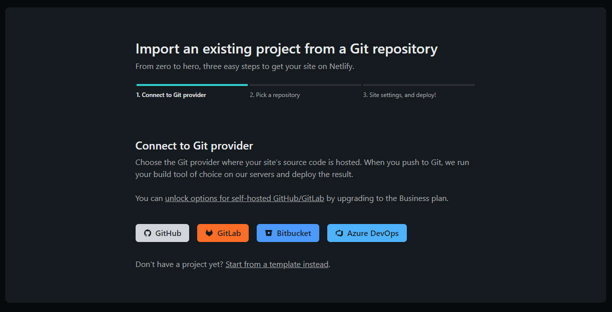
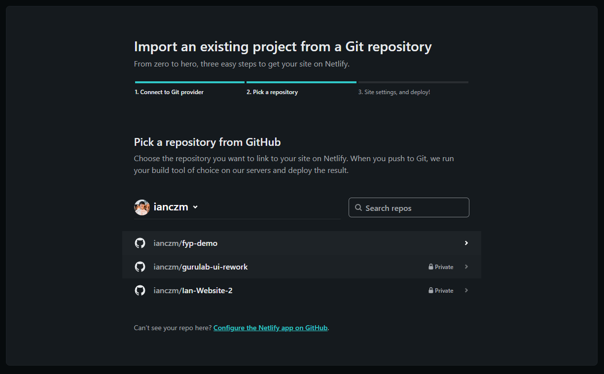
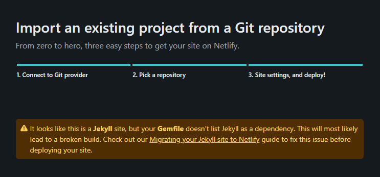
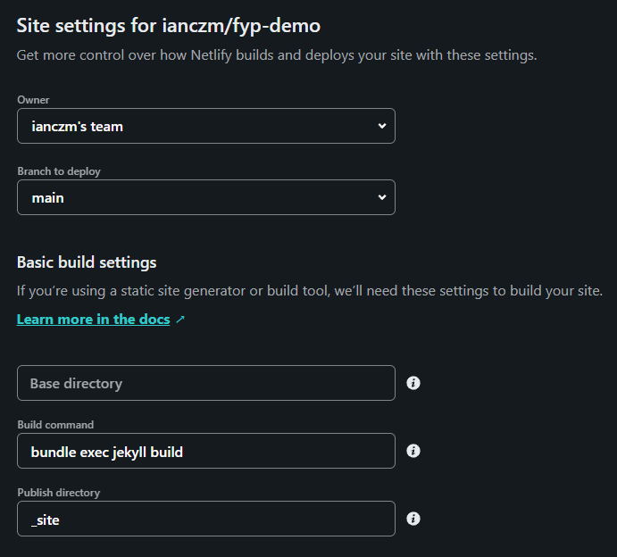
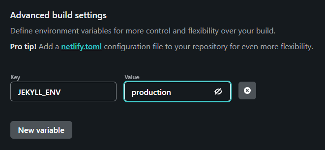

## Installation Steps

Set up the development environment.

- Install WSL2 (if using Windows)
- Install `homebrew`
- Install latest Ruby version - `3.1.2` via `ruby-install`
- Install `bundler` and `jekyll` via `gem`
- Duplicate repository from [ChirpyStarter](https://github.com/cotes2020/chirpy-starter)
- `git clone` repository from GitHub and `cd` into it
- Run `bundler` to install dependencies

---

## Quick Start

Quickly get a project folder scaffolded and a development server up and running, and start writing in minutes.

- Edit `_config.yml` provided in the starter repository to quickly set up author profile and other settings
- Create `authors.yml` file in `_data` with the format shown in the example below
  ```yaml
  ianczm:
    name: Ian Chong
    url: https://github.com/ianczm
  ianczm2:
    name: Chloe Chong
    url: https://github.com/ianczm
  ```
- Create first post in `_posts` folder with name format `year-month-day-title.md`
- Create the front-matter yaml header with the format shown in the example below
  ```yaml
  ---
  title: Jekyll | First Use
  date: 2022-10-10 15:17 +0800
  categories: [fyp]
  tags: [studies, tech, computer science, jekyll]
  published: true
  authors: [ianczm, ianczm2]
  toc:      # boolean (default true)
  comments: # boolean (default configured in _config.yml)
  math:     # boolean (default false)
  mermaid:  # boolean for diagram tool (default false)
  img_path: # string for /img/path to be appended to img urls
  image:    # for header image
    path:   # /path/to/img
    width:  # in pixels
    height: # in pixels
    alt:    # alt text
  pin:      # whether to pin this page to home page
  ---
  ```
- Add content in markdown format below the front-matter header

---

## Deployment

Deployment will be done via Netlify instead of GitHub pages to take full advantage of Jekyll plugins.

- Delete the `.github` folder from the repository as this is not needed for Netlify deploy
- Log in or create a [Netlify](https://www.netlify.com/) account
- Add a new site via import from existing repository
  
- Sign in to the Git provider containing the Jekyll repository
  
- Select the Jekyll repository to deploy
  
- Ignore the warning that appears stating that the `jekyll` dependency is not installed: this is because it is already included in `jekyll-theme-chirpy` which is the theme used for this project
  
- Check configuration
  
- Add `production` environment variable
  
- Deploy site
- Optionally configure the Netlify domain

---

## Typography

Additional configuration and markdown formatting.

- Most resources can be found [here](https://chirpy.cotes.page/posts/text-and-typography/)
- Images can be customised with [additional abbreviations](https://chirpy.cotes.page/posts/write-a-new-post/#images)
- [Prompts](https://chirpy.cotes.page/posts/write-a-new-post/#prompts) can be added too

---

## To Be Explored

- Customising `sass` stylesheet

---

## References

- [Chirpy Wiki](https://chirpy.cotes.page/)
- Using the [Jekyll Compose](https://github.com/jekyll/jekyll-compose) plugin to quickly create pages
